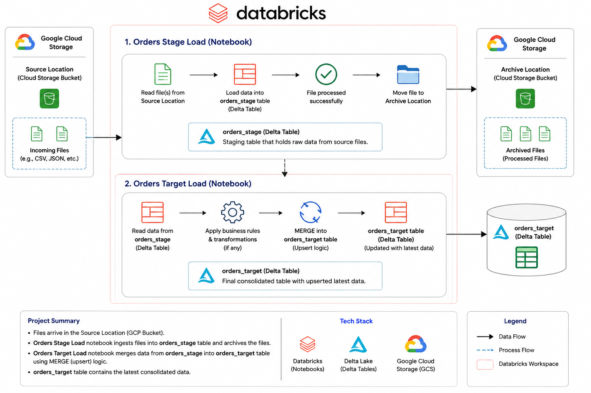

# Databricks Event Driven Data Pipeline

## Project Overview

This project demonstrates an event-driven data ingestion pipeline built using Databricks, Delta Lake, and Google Cloud Storage (GCS).

The pipeline automatically processes incoming order files when they arrive in a GCS bucket. The solution follows a staging and target architecture using Delta tables.

## Project Architecture



## Workflow

### Step 1: Source File Arrival

Order files arrive in a Google Cloud Storage (GCS) bucket configured as the source location.

A Databricks Job is configured with a File Arrival Trigger, which automatically starts processing whenever a new file is detected.

### Step 2: Orders Stage Load

Notebook: `orders_stage_load.ipynb`

Responsibilities:

- Reads files from the source GCS bucket.
- Loads data into the `orders_stage` Delta table.
- Archives processed files to a separate GCS archive location.

### Step 3: Orders Target Load

Notebook: `orders_target_load.ipynb`

Responsibilities:

- Reads data from the `orders_stage` table.
- Creates the `orders_target` table if it does not exist.
- Performs MERGE (UPSERT) operations into the target table.
- Updates existing records and inserts new records.

## Data Flow

```text
GCS Source Bucket
        │
        ▼
Orders Stage Load Notebook
        │
        ▼
orders_stage Delta Table
        │
        ├──► Archive Processed Files
        │
        ▼
Orders Target Load Notebook
        │
        ▼
MERGE / UPSERT Logic
        │
        ▼
orders_target Delta Table
